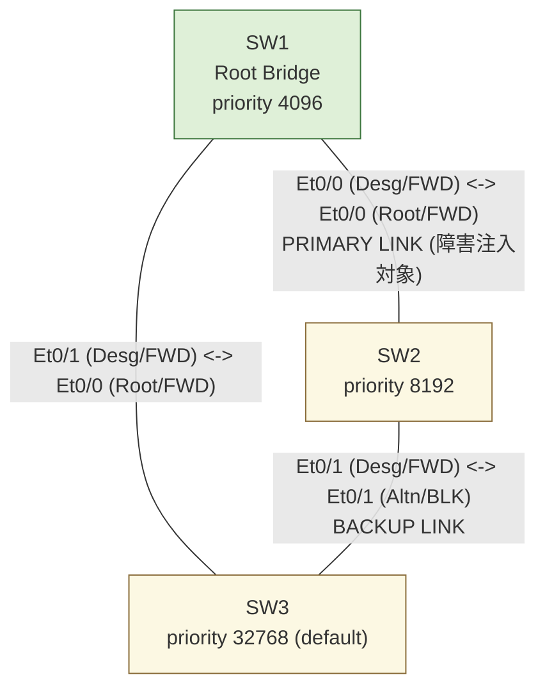

# Cisco CML STP Failure Lab / スパニングツリー障害試験ラボ

Cisco Modeling Labs (CML) 上に **IOL-L2 (ioll2-xe)** ノード3台を用いて構築した、
トライアングル冗長構成における **Rapid PVST+ の障害試験（リンク断→バックアップパス
へのフェイルオーバー→リンク復旧→元トポロジへの復帰）** の検証記録です。

> ⚠️ 本リポジトリには **パスワード・認証情報 (credentials) を一切含みません**。
> CML への接続情報は実行時に環境変数 (`CML_URL` / `CML_HOST` / `CML_USER` /
> `CML_PASSWORD`) で渡し、成果物には保存していません。

## What I implemented / 実装したこと

- IOL-L2 x3 によるトライアングル（三角形）構成のL2冗長トポロジをCML上に構築
  （軽量化のためIOSvL2ではなくIOL-L2を採用し、起動時間・リソース消費を削減）
- `spanning-tree vlan 1 priority` を明示設定し、ルートブリッジ・ブロッキング
  ポートを決定的に固定
- プライマリリンク（SW1-SW2間）の `shutdown` による障害注入と、
  バックアップリンク（SW2-SW3間）へのフェイルオーバーを実機CLIで確認
- リンク復旧後、元のポート役割（Root / Designated / Alternate）へ復帰する
  ことを確認
- 各フェーズ（正常時・障害時・復旧後）で `show spanning-tree vlan 1` /
  `show interfaces status` / `ping` を採取し、結果を整理

---

## Repository layout / ディレクトリ構成

```
cisco-cml-stp-failure-lab/
├── README.md
├── configs/              # 各ノードの day-0 config (running-config相当)
│   ├── SW1.cfg  SW2.cfg  SW3.cfg
├── outputs/              # 検証show/pingコマンドの生出力（3フェーズ分）
│   ├── stp_normal.txt    stp_failure.txt    stp_recovery.txt
│   └── ping_normal_SW2.txt  ping_failure_SW2.txt  ping_recovery_SW2.txt
├── docs/
│   ├── topology.md        # トポロジ図 (Mermaid) とポートマッピング
│   ├── test-plan.md        # 試験項目書
│   ├── verification.md      # 確認結果・合否判定
│   └── status/              # スイッチ毎HTMLステータスシート (SW1/SW2/SW3 + index)
├── cml/
│   └── stp-failure-lab.yaml # CMLラボトポロジ定義（機微情報なし、再構築用）
├── scripts/                # ラボ構築・試験自動化スクリプト（接続情報は環境変数）
│   ├── build_stp_lab.py
│   └── run_stp_failure_test.py
└── .gitignore
```

---

## Project Overview / プロジェクト概要

- **目的 (Goal):** STPの基本機能である「冗長リンクの自動ブロッキング」と
  「障害発生時のフェイルオーバー／復旧後の復帰」を、最小構成で実機的に検証する。
- **対象読者 (Audience):** ネットワークエンジニアのポートフォリオ /
  STP・RSTP学習者向けリファレンス。
- **範囲 (Scope):** 単一VLAN (VLAN1)・3ノードのトライアングル構成のみ。
  MSTPやPortFast/BPDU Guard等は対象外（軽量な単一障害点の検証に特化）。
- **環境 (Platform):** CML 2.10 / ノード定義 `ioll2-xe` (IOL-L2, Docker)。

---

## Architecture / アーキテクチャ



詳細な構成図・シーケンス図は [docs/topology.md](docs/topology.md) を参照。

- ルートブリッジ: SW1（`priority 4096`）
- バックアップパス: SW2-SW3間リンク（正常時はSW3 Et0/1がAlternate/Blocking）
- 障害注入点: SW1-SW2間リンク（SW1側 Et0/0 を `shutdown`）

## Test Summary / 試験結果サマリ

| フェーズ | SW3 Et0/1 (バックアップポート) | SW2→SW3 疎通 |
|---|---|---|
| 正常時 | Alternate / **Blocking** | OK |
| 障害時（SW1-SW2間リンク断） | Alternate/Blocking → **Designated / Forwarding** | OK（バックアップパス経由） |
| 復旧後 | **Alternate / Blocking** へ復帰 | OK |

全8試験項目すべて OK。詳細は [docs/verification.md](docs/verification.md)、
試験項目書は [docs/test-plan.md](docs/test-plan.md) を参照。

### Status Sheets (HTML)

スイッチ毎の3フェーズ状態を整理したHTMLステータスシートです。クリックするとGitHub Pages上でレンダリングされた状態で開きます（ソースコード表示ではありません）。

- 🔗 **[全スイッチサマリ (index)](https://yasuwo070809.github.io/cisco-cml-stp-failure-lab/status/)**
- 🔗 [SW1 (Root Bridge)](https://yasuwo070809.github.io/cisco-cml-stp-failure-lab/status/SW1.html)
- 🔗 [SW2](https://yasuwo070809.github.io/cisco-cml-stp-failure-lab/status/SW2.html)
- 🔗 [SW3](https://yasuwo070809.github.io/cisco-cml-stp-failure-lab/status/SW3.html)

（ソースを直接見たい場合は [docs/status/](docs/status/) 配下を参照）

### 技術的な観察事項

CML上のIOL-L2間仮想リンクは、片側の `shutdown` が対向インタフェースの
リンクキャリア断として即座には伝播されないため、STPの再収束はRSTPの
高速な Proposal/Agreement ではなく **BPDU Max Age（20秒）タイムアウト**
経由で発生した。詳細は [docs/verification.md](docs/verification.md) の
「観察事項」を参照。

---

## Reproduce / 再現方法

```bash
export CML_URL=https://<your-cml-host>
export CML_HOST=<your-cml-host-or-ip>
export CML_USER=<your-user>
export CML_PASSWORD=<your-password>

python scripts/build_stp_lab.py
python scripts/run_stp_failure_test.py
```

`cml/stp-failure-lab.yaml` をCMLのTopology Import機能で直接インポートすることも可能。
