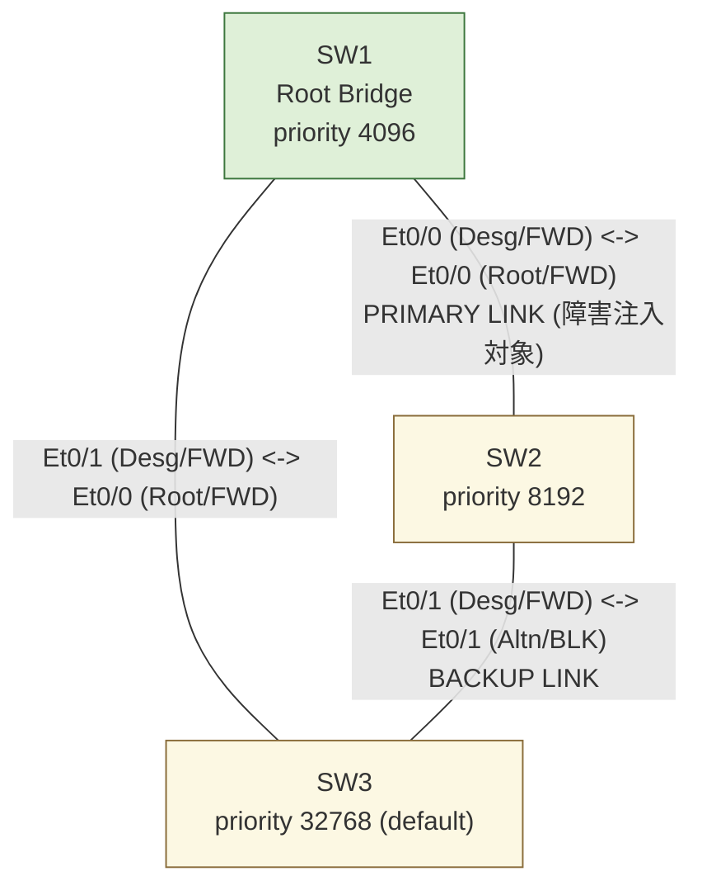
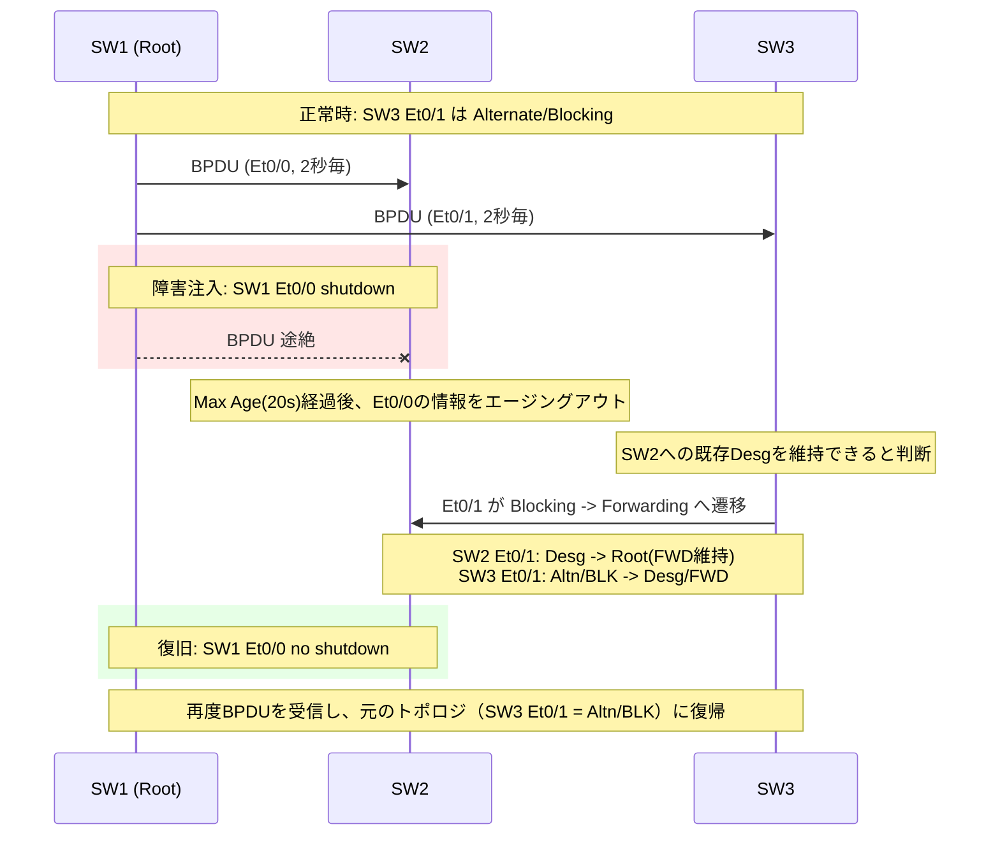

# トポロジ構成

## 概要

Cisco Modeling Labs (CML) 上に **IOL-L2 (ioll2-xe)** ノードを3台使用し、
トライアングル（三角形）構成のスパニングツリー冗長トポロジを構築した。
IOSvL2ではなくIOL-L2（Docker/コンテナベースの軽量イメージ）を採用することで、
起動時間とリソース消費を抑えている。

- STPモード: Rapid PVST+ (`spanning-tree mode rapid-pvst`)
- 対象VLAN: VLAN 1（デフォルトVLANのみを使用する最小構成）
- ルートブリッジ: SW1（`priority 4096` を明示設定し決定的に固定）

## 構成図

## ポートマッピング表（正常時）

| リンク | SW側インタフェース | 役割/状態 | 対向インタフェース | 役割/状態 | 備考 |
|---|---|---|---|---|---|
| SW1 - SW2 | SW1 Et0/0 | Desg / FWD | SW2 Et0/0 | Root / FWD | 障害注入対象リンク |
| SW1 - SW3 | SW1 Et0/1 | Desg / FWD | SW3 Et0/0 | Root / FWD | |
| SW2 - SW3 | SW2 Et0/1 | Desg / FWD | SW3 Et0/1 | **Altn / BLK** | バックアップリンク（正常時ブロッキング） |

## 障害試験シナリオ

SW1 の Et0/0（SW1-SW2間のプライマリリンク）を `shutdown` し、
ルートブリッジ(SW1)への直接リンクを喪失した SW2 が、
SW3経由のバックアップパス（SW2-SW3間リンク、正常時はSW3側 Alternate/Blocking）
へフェイルオーバーすることを確認する。

